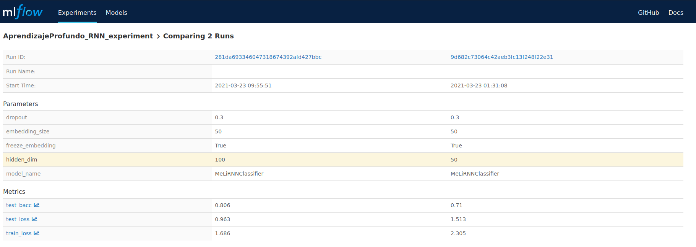
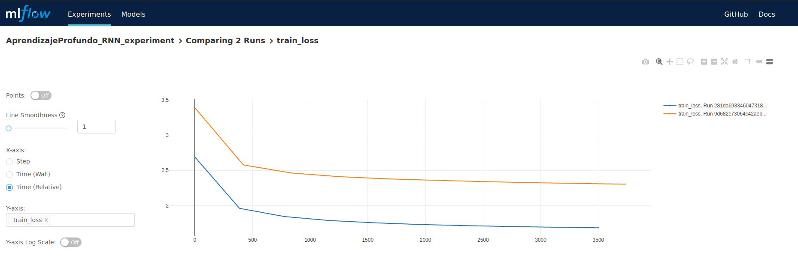
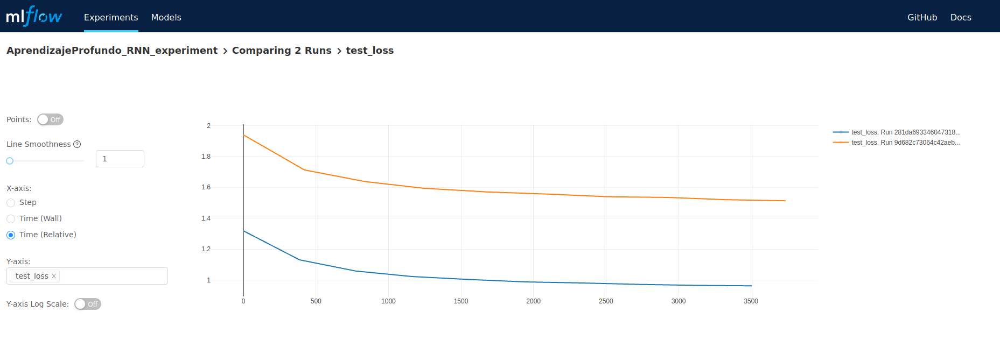
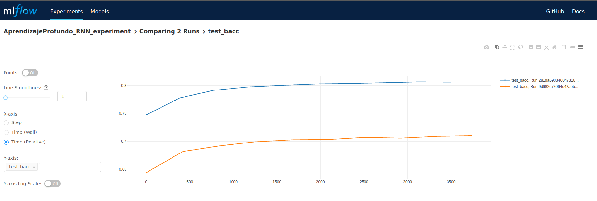

# TPAprendizajeProfundo
Resolucion tp materia optativa aprendizaje profundo de diplomatuda de ciencia de datos de Famaf 2020

Para este trabajo practico se entrenaron 3 tipos de redes neuronales y 2 configuraciones de hiperparametros distintas para cada tipo de red.

## RNN

### Model

```
class MeLiRNNClassifier(torch.nn.Module) :
    def __init__(self, pretrained_embeddings_path, 
                 dictionary,
                 vector_size,
                 freeze_embedings,
                 hidden_dim,
                dropout=0.3, output_layer=632):
        super().__init__()
        self.hidden_dim = hidden_dim
        self.dropout = nn.Dropout(dropout)
        
        embeddings_matrix = torch.randn(len(dictionary), vector_size)
        embeddings_matrix[0] = torch.zeros(vector_size)
        with gzip.open(pretrained_embeddings_path, "rt") as fh:
            for line in fh:
                word, vector = line.strip().split(None, 1)
                if word in dictionary.token2id:
                    embeddings_matrix[dictionary.token2id[word]] =\
                        torch.FloatTensor([float(n) for n in vector.split()])
        
        self.embeddings = nn.Embedding.from_pretrained(embeddings_matrix,
                                                       freeze=freeze_embedings,
                                                       padding_idx=0)
        
        self.lstm = nn.LSTM(vector_size, hidden_dim, batch_first=True)
        self.linear = nn.Linear(hidden_dim, output_layer)
        
    def forward(self, x, s):
        x = self.embeddings(x)
        x = self.dropout(x)
        x_pack = pack_padded_sequence(x, s, batch_first=True, enforce_sorted=False)
        out_pack, (ht, ct) = self.lstm(x_pack)
        out = self.linear(ht[-1])
        return out
```

Al modelo definido ingresa la oracion input como vector embedding de las palabras, y el modelo en si esta compuesto por ima capa LSTM de dimension variable luego conectada a una capa linear de salida.

### Experiments



### Train Loss




### Test Loss



### Balanced Accuracy Plot



El mejor modelo entre ambas configuraciones es el que cuenta con ```hidden_dim = 100``` con un balanced accuracy igual a 0.806.
Ambos modelos demoraron en promedio 1.15h en entrenarse en GPU para 10 epochs (Nvidia GTX 1060 - 3Gb VRAM) 