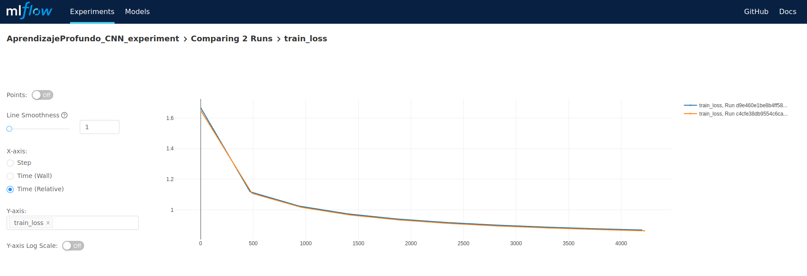

# TPAprendizajeProfundo
Resolucion tp materia optativa aprendizaje profundo de diplomatuda de ciencia de datos de Famaf 2020

Para este trabajo practico se entrenaron 3 tipos de redes neuronales y 2 configuraciones de hiperparametros distintas para cada tipo de red.

## RNN

### Model

```
class MeLiRNNClassifier(torch.nn.Module) :
    def __init__(self, pretrained_embeddings_path, 
                 dictionary,
                 vector_size,
                 freeze_embedings,
                 hidden_dim,
                dropout=0.3, output_layer=632):
        super().__init__()
        self.hidden_dim = hidden_dim
        self.dropout = nn.Dropout(dropout)
        
        embeddings_matrix = torch.randn(len(dictionary), vector_size)
        embeddings_matrix[0] = torch.zeros(vector_size)
        with gzip.open(pretrained_embeddings_path, "rt") as fh:
            for line in fh:
                word, vector = line.strip().split(None, 1)
                if word in dictionary.token2id:
                    embeddings_matrix[dictionary.token2id[word]] =\
                        torch.FloatTensor([float(n) for n in vector.split()])
        
        self.embeddings = nn.Embedding.from_pretrained(embeddings_matrix,
                                                       freeze=freeze_embedings,
                                                       padding_idx=0)
        
        self.lstm = nn.LSTM(vector_size, hidden_dim, batch_first=True)
        self.linear = nn.Linear(hidden_dim, output_layer)
        
    def forward(self, x, s):
        x = self.embeddings(x)
        x = self.dropout(x)
        x_pack = pack_padded_sequence(x, s, batch_first=True, enforce_sorted=False)
        out_pack, (ht, ct) = self.lstm(x_pack)
        out = self.linear(ht[-1])
        return out
```

Al modelo definido ingresa la oracion input como vector embedding de las palabras, y el modelo en si esta compuesto por uma capa LSTM de dimension variable luego conectada a una capa linear de salida.

### Experiments


### Train Loss


### Test Loss


### Balanced Accuracy Plot


El mejor modelo entre ambas configuraciones es el que cuenta con ```hidden_dim = 100``` con un balanced accuracy igual a 0.806.
Ambos modelos demoraron en promedio 1.15h en entrenarse en GPU para 10 epochs (Nvidia GTX 1060 - 3Gb VRAM)

## CNN

### Model

```
class MeLiCNNClassifier(nn.Module):
    def __init__(self, 
                 pretrained_embeddings_path, 
                 dictionary,
                 vector_size,
                 freeze_embedings,
                 output_layer=632):
        super().__init__()
        embeddings_matrix = torch.randn(len(dictionary), vector_size)
        embeddings_matrix[0] = torch.zeros(vector_size)
        with gzip.open(pretrained_embeddings_path, "rt") as fh:
            for line in fh:
                word, vector = line.strip().split(None, 1)
                if word in dictionary.token2id:
                    embeddings_matrix[dictionary.token2id[word]] =\
                        torch.FloatTensor([float(n) for n in vector.split()])
        self.embeddings = nn.Embedding.from_pretrained(embeddings_matrix,
                                                       freeze=freeze_embedings,
                                                       padding_idx=0)
        self.convs = []
        for filter_lenght in FILTERS_LENGTH:
            self.convs.append(
                nn.Conv1d(vector_size, FILTERS_COUNT, filter_lenght)
            )
        self.convs = nn.ModuleList(self.convs)
        self.fc = nn.Linear(FILTERS_COUNT * len(FILTERS_LENGTH), 128)
        self.output = nn.Linear(128, output_layer)
        self.vector_size = vector_size
    
    @staticmethod
    def conv_global_max_pool(x, conv):
        return F.relu(conv(x).transpose(1, 2).max(1)[0])
    
    def forward(self, x):
        x = self.embeddings(x).transpose(1, 2)  # Conv1d takes (batch, channel, seq_len)
        x = [self.conv_global_max_pool(x, conv) for conv in self.convs]
        x = torch.cat(x, dim=1)
        x = F.relu(self.fc(x))
        x = self.output(x)
        return x
```

Al modelo definido ingresa la oracion input como vector embedding de las palabras, y el modelo en si esta compuesto por una capa convolucional que toma la oracion por palabras de largo definido en FILTER_LENGTH. De la capa convolucional se conecta a 2 capas lineales.

### Experiments


### Train Loss




### Test Loss


### Balanced Accuracy Plot


Entre ambas configuraciones la metrica de balanced accuracy no varia significativamente, es por eso que el modelo con ```fc_size = 128``` es el mejor, ya que tiene menos pesos para entrenar. El resultado de balanced accuracy es igual a 0.876
Ambos modelos demoraron 1.3h en entrenarse en GPU para 10 epochs (Nvidia GTX 1060 - 3Gb VRAM)

## MLP

### Model

```
class MeLiMLPClassifier(nn.Module):
    def __init__(self, 
                 pretrained_embeddings_path, 
                 dictionary,
                 vector_size,
                 freeze_embedings,
                 output_layer=632):
        super().__init__()
        embeddings_matrix = torch.randn(len(dictionary), vector_size)
        embeddings_matrix[0] = torch.zeros(vector_size)
        with gzip.open(pretrained_embeddings_path, "rt") as fh:
            for line in fh:
                word, vector = line.strip().split(None, 1)
                if word in dictionary.token2id:
                    embeddings_matrix[dictionary.token2id[word]] =\
                        torch.FloatTensor([float(n) for n in vector.split()])
        self.embeddings = nn.Embedding.from_pretrained(embeddings_matrix,
                                                       freeze=freeze_embedings,
                                                       padding_idx=0)
        self.hidden1 = nn.Linear(vector_size, 128)
        self.hidden2 = nn.Linear(128, 128)
        self.output = nn.Linear(128, output_layer)
        self.vector_size = vector_size
    
    def forward(self, x):
        x = self.embeddings(x)
        x = torch.mean(x, dim=1)
        x = F.relu(self.hidden1(x))
        x = F.relu(self.hidden2(x))
        x = torch.sigmoid(self.output(x))
        return x
```

Al modelo definido ingresa la oracion input como vector embedding de las palabras, y el modelo en si esta compuesto 2 capas lineales ocultas de dimension variable, y una ultima capa lineal de salida. 

### Experiments


### Train Loss


### Test Loss


### Balanced Accuracy Plot


El mejor modelo entre ambas configuraciones la metrica de balanced accuracy no varia significativamente, es por eso que el modelo con ```hidden1_size = 128``` y ```hidden2_size = 128``` es el mejor, ya que tiene menos pesos para entrenar. El resultado de balanced accuracy es igual a 0.44
Ambos modelos demoraron 1.15h en entrenarse en GPU para 10 epochs (Nvidia GTX 1060 - 3Gb VRAM)

## Conclusion Final

De los 3 experimentos el modelo que mejor performa es el CNN, con mejor resultado por poco por encima del de RNN. El modelo que peor performa es el de MLP.
Podria experimentarse con entrenar un modelo de CNN con otros valores de FILTER_LENGTH para investigar si mejor aun mas. 
Si bien CNN fue el modelo que mas demoro en entrenarse, la diferencia no es muy significativa con respecto a los demas, por lo cual aun sigue siendo la mejor opcion.